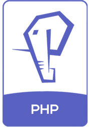
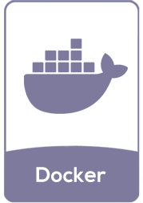
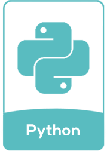
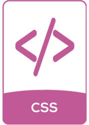

# ¡Hola  encantad@ de conocerte!
Soy Jose María Sampedro y soy Full Stack Developer en [Denox](https://denox.es).

 

<h2 align="left">🛠️ Tecnologías y herramientas que uso:</h2>

 

<h2 align="left">👨🏻‍💻 Sobre mi:</h2>
💻 Actualmente estoy trabajando en mejorar el e-commerce en [Denox](https://denox.es) 
⏳ Explorando nuevas arquitecturas de Software 
🚀 Listo para colaborar y apoyar 
👨‍💻 Mi hobby es crear script de automatización 
🯠Disfruto realizando proyectos que salen fuera de mi zona de confort tanto en diseño como electrónica 
⚡ Frase que me define: "Me lo contaron y lo olvidé; lo vi y lo entendí; lo hice y lo aprendí."